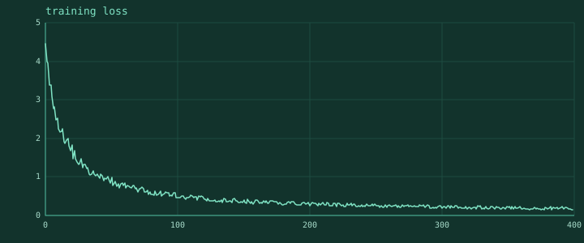

<p align="center">
  
</p>

<h1 align="center">weft</h1>

<p align="center">
  <b>Plots for <a href="https://github.com/twill-lang/twill">twill</a>: in the terminal, and out of it.</b><br>
  Written in twill.
</p>

<p align="center">
  
  
  
  
</p>

---

## It runs

`weft` is written in twill, in `.tw` files, using `mode systems`. That subset
did not exist when this library was written, so for a long time none of the code
here executed and this section said so. twill 1.6 is the release that closed it:
the 6 test suites under `tests/` pass, and CI runs them against a released
twill on every push rather than gating on the prose in this file.

```bash
twill test tests
```

You need twill 1.6.0-rc1 or newer. `docs/needs.md` is still worth reading -- it
is the list of what this library asked the language for, and it now records
which of those arrived and which are still open.

## The plot it exists for

<p align="center">
  
</p>

That is the SVG export of a training run: 400 steps, the axis chosen by the same
code that draws the terminal version, the palette twill's. In the terminal the
same series is braille, repainted in place, and the axis holds still while the
numbers arrive.

## Status

| Piece | State |
| --- | --- |
| Tick selection on the 1/2/5 ladder | written, unrun |
| Line, scatter, bar, histogram, heatmap, sparkline | written, unrun |
| Braille and block canvas, ASCII fallback | written, unrun |
| The live loss curve: streaming, in-place repaint, settled axis | written, unrun |
| SVG export sharing the terminal's axis | written, unrun |
| Tests | written, blocked on a test runner |
| Reading twill's `src/term/` for capability negotiation | written, blocked on vendoring, see below |
| Interactivity, panning, zooming | **not planned.** weft draws, it does not browse |
| A PNG or PDF backend | **not planned.** SVG is the export |
| 3-D, contour, violin, box plots | **not planned for v0.1** |
| Anything running end to end | **no** |

## The worked example

A training loop with a live plot. This is the whole of the API for the case
almost everyone hits first.

```rust
mode systems

import "twill_modules/twill/src/term/caps.tw" as cp
import "twill_modules/weft/src/live.tw" as live

fn main() {
  let plot = live.new(cp.detect(), "training loss", 72, 12)

  let step: I64 = 0
  while step < 4000 {
    let loss = train_one_step(step)
    write_out(live.push(plot, loss, now_ms()))   # usually returns ""
    step = step + 1
  }
  write_out(live.close(plot))
}
```

`push` is called every step and returns the empty string most of the time,
because the repaint rate limit decides when a frame is due. The cost per step is
an add and a compare.

A chart built up and rendered once:

```rust
import "twill_modules/weft/src/chart.tw" as ch
import "twill_modules/weft/src/svg.tw" as svg

let c = ch.chart("val loss by learning rate", 72, 14)
c.x_label = "epoch"
c.series.push(ch.series_y("1e-3", losses_a, ch.MARK_LINE))
c.series.push(ch.series_y("3e-4", losses_b, ch.MARK_LINE))

write_out(ch.render(c, cp.detect()))                    # to the terminal
write_file("compare.svg", svg.render(c, svg.box(720, 320)))   # and to a file
```

Both calls take the same `Chart`. The SVG and the terminal derive their scale
from one `Axis`, so a plot in a pull request and a plot on a screen never show
different ranges of the same data.

`ch.render_framed(c, cp.detect())` is the same terminal plot inside a rounded
panel, the title set into the top border rather than printed above the plot. It
degrades to an ASCII frame where the terminal cannot draw box glyphs, and reads
as one object when a report stacks several plots down a page.

## What is actually hard here

**Ticks.** Divide a range by six and the labels come out 0.037, 0.074, 0.111,
and the reader has to do arithmetic to answer "roughly what is this". weft
picks the step from the 1/2/5 ladder and then moves the axis bounds outward onto
it. `src/scale.tw`.

**An axis that does not jitter.** Rescaling from the data on every frame makes
the whole plot slide under the reader, and every individual frame of it is
correct. weft grows the range immediately when a point falls outside it, and
shrinks only after the data has stayed inside the middle two thirds of the range
for thirty consecutive frames. `scale.settle`.

**A run longer than the plot.** A 90,000-step run cannot keep every point.
Points are folded into buckets on arrival and the buckets halve when the history
fills, so the beginning of the curve, which is the part people look at, stays on
screen. A ring buffer would show the last N steps and hide the drop.
`live.compact`.

**Degrading.** The ladder is twill's, from `docs/cli-design.md`, not a second
one invented here.

| Signal | weft draws |
| --- | --- |
| truecolour | full palette, the heatmap ramp, per-series colour |
| 256 colour | flat per-series colour; the heatmap becomes glyph density, because a quantised ramp reads as a defect |
| plain, `NO_COLOR`, not a tty | no escape bytes at all; the plot is exactly the characters it would have printed |
| unicode | braille, 2 by 4 dots per cell; eighth-blocks for bars |
| no unicode | ASCII marks, `#` bars, `.` and `:` density |
| tty | in-place repaint, identical frames never resent |
| no tty | one log line every fifty steps, never one per step |

## The dependency on twill's `src/term/`

twill already solved capability negotiation, colour quantising and width-aware
truncation in `src/term/`, and `docs/cli-design.md` records the rules. weft uses
that code rather than writing a second copy with its own opinion about what
`NO_COLOR` means.

**It is not importable as a library today, and this is worth being precise
about.** twill's `import "std/..."` reaches modules compiled into the binary,
and `src/term/` is not one of them. Every other import is a file path. So weft
declares twill as a dependency in `spool.toml` and imports the files out of the
vendored copy:

```rust
import "../twill_modules/twill/src/term/caps.tw" as cp
```

That works, and it is fragile: it depends on twill's internal directory layout,
which twill has never promised. The clean fix is for twill to expose
`std/term/caps` as a standard-library module, which is the first entry in
[`docs/needs.md`](docs/needs.md). Until then the path above is the honest
arrangement, and it is written down rather than hidden behind a copied file.

## Palette

twill's, unchanged.

| Role | Hex | Where |
| --- | --- | --- |
| pale | `#D2F0E4` | the second series |
| mint | `#A8DCCB` | tick labels in the SVG |
| accent | `#7FE3C4` | the first series, titles |
| teal | `#4FB79B` | axes, rules, gridlines |
| deep | `#12332C` | the SVG plate, the low end of the heatmap ramp |

Series colours are assigned accent, pale, teal, mint, in that order. Past four
series, colour has stopped being the distinguisher and the legend is doing the
work.

## Layout

```
src/
  scale.tw      ticks, bounds, projection, the settling live axis
  canvas.tw     braille, blocks, ASCII: a subcell dot grid
  chart.tw      axes, gutter, legend, the render loop
  bars.tw       bar charts and histograms, with bin selection
  heatmap.tw    a matrix as colour, as density where colour is missing
  sparkline.tw  one line of shape, no axes
  live.tw       the streaming loss curve
  svg.tw        the same charts, off the terminal
  theme.tw      the palette and what each colour means
  fmtnum.tw     axis labels, which is the only place a number is written out
tests/          one file per source file, harness.tw is the runner
docs/needs.md   what the language still owes this code
examples/       loss.tw, the training loop above
```

## The sibling repositories

- [twill](https://github.com/twill-lang/twill), the language.
- [spool](https://github.com/twill-lang/spool), the package manager.
- [warp](https://github.com/twill-lang/warp), data pipelines and dataset
  loaders. warp loads it, weft draws it.

## Licence

MIT.
